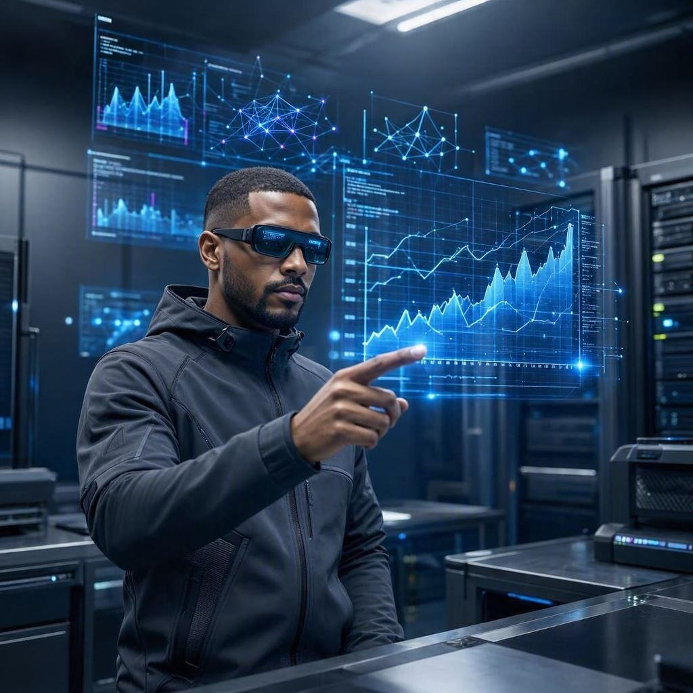

# Cientista de Dados do Futuro 🌌✨

## 📒 Descrição
Imagem hiper-realista gerada por Inteligência Artificial representando 
um cientista de dados do futuro, interagindo com hologramas de dados 
em um laboratório futurista. O objetivo foi criar um visual tão 
realista que desafie a percepção humana entre o real e o artificial.

## 🤖 Tecnologias Utilizadas
- **Microsoft Bing Image Creator** (DALL-E) — geração da imagem
- **Engenharia de Prompt** — criação e refinamento do prompt em inglês

## 🧐 Processo de Criação
Defini o tema: um cientista de dados analisando hologramas em um 
ambiente futurista. Elaborei um prompt detalhado em inglês, descrevendo 
a cena, a iluminação cinematográfica, os óculos inteligentes, os 
gráficos holográficos azuis e a resolução 8K. Submeti o prompt no 
Bing Image Creator e selecionei o resultado mais realista entre as 
opções geradas.

## 🚀 Resultados

A imagem gerada apresenta um nível de realismo impressionante: 
iluminação dramática, reflexos realistas nos óculos, hologramas 
com gráficos de linha e redes neurais, e uma composição que remete 
a uma produção fotográfica profissional de ficção científica.

## 💭 Reflexão
O maior desafio foi elaborar um prompt preciso o suficiente para 
guiar a IA até o resultado desejado. Pequenos detalhes no texto 
(como "cinematic lighting" e "8K resolution") fizeram toda a 
diferença na qualidade final. A IA não substitui a criatividade 
humana — ela a amplifica.

---
Criado por **Raphael Gustavo da Silva** como parte do desafio 
**#LabDIONattyOrNot** 🚀
